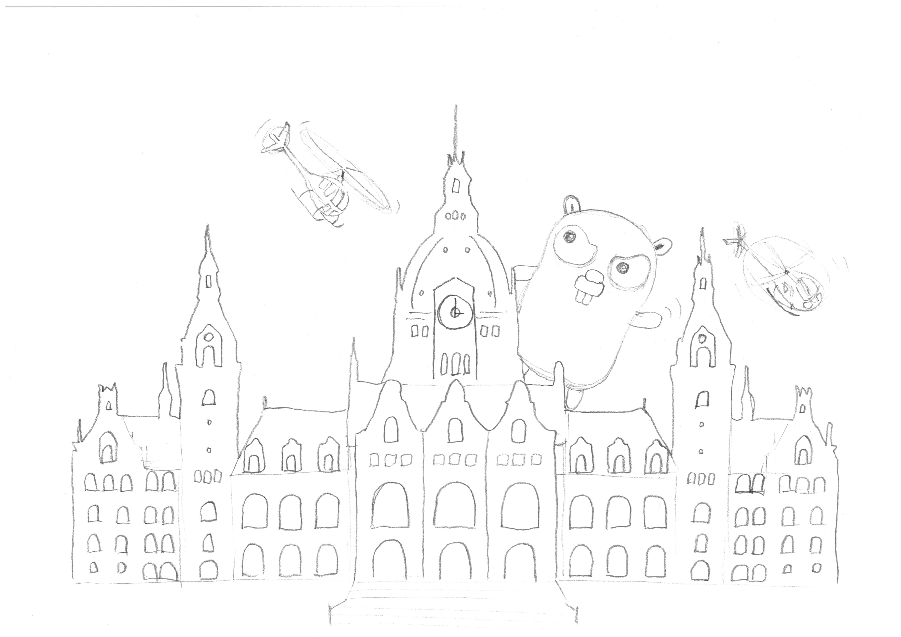

# Wer wir sind

* Tobias Pauling
* Christoph Voigt

# Wo sind wir hier

* https://www.newstore.com/
* **Kein Recruiting event!**
  * aber wenn ihr interessiert seid wäre es nett, wenn ihr bei der Bewerbung unsere Namen erwähnen würdet ✌️😁

# Warum Golang Meetup?

* kaum community in Hannover (HannoverJS, Rust, Python… aber kein Go?)
* Go meetup gab es vor einem Jahr, ist aber eingeschlafen
  * Neustart!
  * monatlich; abhängig von Teilnahme und Talks
* Knowledge sharing
* Termin findung

**Wer seid ihr, warum seid ihr hier und was erwartet ihr von einem Meetup?**

* "Community" sollen das Meetup mitgestalten
  * ein talk pro meetup
  * live coding
* als "community" allen interessierten Go näher bringen

# In eigener Sache

* Wir wollen Sticker drucken...
* Kennt sich jemand mit Illustrator/InkScape aus?

